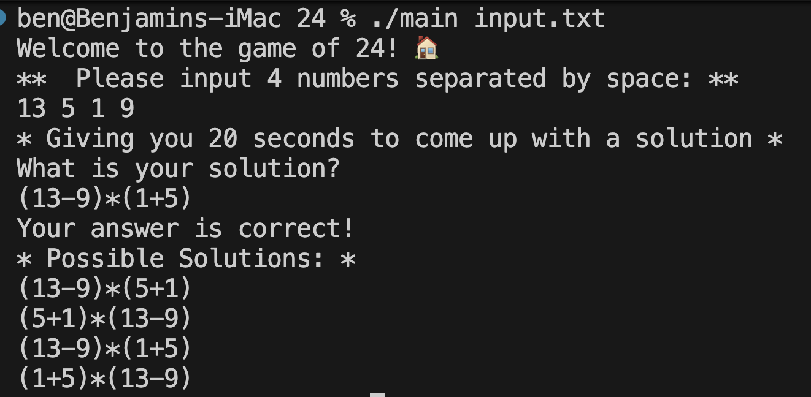

# 24 Game

A C++ implementation of the mathematical card game "24" where players use four numbers and basic arithmetic operations (+, −, ×, ÷) to make 24.

**Authors:** Benjamin Zhao, Leonardo Li

---

## Features

### Interactive Game (`./main`)
- **Freeplay Mode**: Input your own 4 numbers
- **Multiplayer Mode**: Compete with randomly generated numbers
- 20-30 second timer with automatic validation
- Shows all possible solutions

### Standalone Solver (`./solver`)
- Finds **all unique solutions** using brute-force
- Tests all 5 parenthesization patterns
- Handles fractional intermediate results (e.g., `8÷(3−8÷3)=24` for "3 3 8 8")

---

## Installation
```bash
git clone https://github.com/benz3927/24.git
cd 24
make all
```

---

## Usage

### Game Mode
```bash
./main input.txt
```

### Solver Mode
```bash
./solver
```

**Example:**
```
Enter 4 integers (or 'quit' to exit): 3 3 8 8
Numbers: 3 3 8 8 
Found 1 solution(s):
  1. 8/(3-(8/3)) = 24

Enter 4 integers (or 'quit' to exit): 5 6 3 1
Numbers: 5 6 3 1 
Found 20 solution(s):
  1. (1+(3*6))+5 = 24
  2. ((1+5)*3)+6 = 24
  ...
```

---

## Screenshots




---

## Algorithms

**Game Mode:** Recursive pair reduction with custom stack-based expression parser

**Solver Mode:** Brute-force enumeration testing all permutations × operators × 5 parenthesization patterns (7,680 total expressions)

---

## Project Structure
```
24/
├── main.cpp           # Game entry point
├── TwentyFour.cpp/h   # Recursive algorithm
├── 24_solver.cpp      # Brute-force solver
├── stack.cpp/h        # Custom stack implementation
├── node.cpp/h         # Stack node
├── game.cpp/h         # Game modes
├── player.cpp/h       # Player management
├── Makefile           # Build configuration
└── *.png              # Screenshots
```

---

## Build Commands
```bash
make all       # Build both game and solver
make           # Build game only
make solver    # Build solver only
make clean     # Remove binaries
```

---

## Contact

Benjamin Zhao - bzhao@hamilton.edu  
Hamilton College